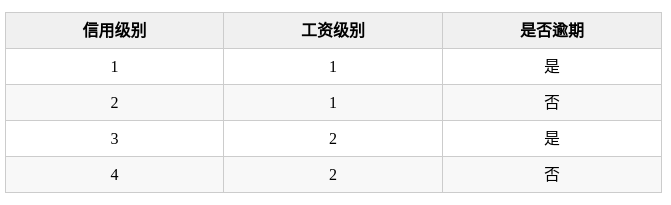

<!--
 * @Author: your name
 * @Date: 2019-12-22 09:58:20
 * @LastEditTime : 2019-12-22 10:41:10
 * @LastEditors  : Please set LastEditors
 * @Description: In User Settings Edit
 * @FilePath: /Machine_Learning/Decision Tree/DecisionTree.md
 -->
#### 1.1什么是决策树
决策树是一种常见的机器学习算法，它的思想十分朴素，类似于我们平时利用选择做决策的过程。它是类似流程图的结构，其中每个内部节点表示一个测试功能，即类似做出决策的过程（动作），每个叶节点都表示一个类标签，即在计算所有特征之后做出的决定（结果）。标签和分支表示导致这些类标签的功能的连接。从根到叶的路径表示分类规则。比如下面这个“相亲决策树”：

用决策树分类：从根节点开始，对实例的某一特征进行测试，根据测试结果将实例分配到其子节点，此时每个子节点对应着该特征的一个取值，如此递归的对实例进行测试并分配，直到到达叶节点，最后将实例分到叶节点的类中。
#### 1.2决策树与条件概率
决策树表示给定特征条件下，类的条件概率分布，这个条件概率分布表示在特征空间的划分上，将特征空间根据各个特征值不断进行划分，就将特征空间分为了多个不相交的单元，在每个单元定义了一个类的概率分布，这样，这条由根节点到达叶节点的路径就成了一个条件概率分布。

假设X表示特征的随机变量，Y表示类的随机变量，那么这个条件概率可以表示为$P(Y|X)$，其中X取值于给定划分下单元的集合，Y取值于类的集合。各叶结点（单元）上的条件概率往往偏向某一个类。
根据输入的测试样本，由路径找到对应单元的各个类的条件概率，并将该输入测试样本分为条件概率最大的一类中，就可以完成对测试样本的分类。

#### 2.1 决策树学习目标和本质
假设给定训练数据集$D =(x_1,y_1),(x_2,y_2),....(x_N,y_N)$,其中$x_i=(x_i(1),x_i(2),.......,x_i(n))^T$为输入实例，n为特征个数，i=1,2,3.....N N为样本容量。$y_i = {1,2,3......,k}$,K是类标记。

学习目标：根据给定的训练数据集构建一个决策模型，使它能够对实例进行正确的分类。
决策树学习本质上是从训练数据集中归纳出一组分类规则。与训练数据集不相矛盾的决策树（即能对训练数据进行正确分类的决策树）可能是0个或多个。我们需要找到一个与训练数据矛盾较小的决策树，同时具有很好的泛化能力。

从另一个角度看，决策树学习是由训练数据集估计条件概率模型。基于特征空间划分的类的条件概率模型有无穷多个。我们选择的条件概率模型应该不仅对训练数据有很好地拟合，而且对未知数据有很好地预测。

#### 2.2决策树构建步骤

- 特征选择
- 决策树生成(在ID3_and_Pruning.md中介绍)
- 决策树剪枝(在ID3_and_Pruning.md中介绍)

决策树学习的算法通常是一个递归地选择最优特征，并根据该特征对训练数据进行分割，使得对各个子数据集有一个最好的分类的过程。这一过程对应着对特征空间的划分，也对应着决策树的构建。
************************
##### 每个节点在哪个维度做划分？选好了维度，如何确定阈值呢？

#### 3.1决策树特征选择相关概念
##### 1.信息熵
引申到信息论和概率统计中，信息熵表示随机变量的不确定度。对于一组数据来说，越随机、不确定性越高，信息熵越大；不确定性越低，信息熵越小。

为了计算熵，我们需要计算所有类别所有可能值所包含的信息期望值，著名的香农公式：
```math
H=-\sum_{i=1}^Kp_ilog(p_i)
```
在一个系统中，有k类的信息，$p_i$其中是选择该分类的概率（n/k），再乘p的对数，求和后加上负号。这是因为$p_i$概率是小于1的数，$log(p_i)$是小于0的数，我们要求得到的熵是大于0的。

##### 2.条件熵
设有随机变量(X,Y)。条件熵H(Y|X)表示在已知随机变量X的条件下随机变量Y的不确定性。
随机变量X给定的条件下随机变量Y的条件熵H(Y|X)定义为给定条件下，Y的条件概率分布的熵对的数学期望:
```math
H(Y|X) = \sum_{i=1}^np_iH(Y|X=x_i)

```
其中,$p_i =P(X=x_i),i=1,2,....n$

其实条件熵意思是按一个新的变量的每个值对原变量进行分类，比如上面这个题把“见与不见”按“年龄”分成了两类。

然后在每一个小类里面，都计算一个小熵，然后每一个小熵乘以各个类别的概率，然后求和。

所谓小类，就是不包含当前所选特征的其他维度，即当前的特征是给定的条件，在其他维度下求熵，是条件下的。各类别的概率，是当前这个小类别（年龄>30）下的样本量除以总的样本量。

##### 3.信息增益
在划分数据集前后信息发生的变化称为信息增益，获得信息增益最高的特征就是最好的选择。
信息增益就是： 
以某特征划分数据集前后的熵的差值

划分前，样本集合D的熵（也称经验熵）是为H(D)；使用某个特征A划分数据集D，计算划分后的数据子集（给定特征A的情况下，数据集D）的条件熵（经验条件熵）H(D|A)。则公式为：
```math
g(D,A) = H(D) - H(D|A)
```
在计算过程中，使用所有特征划分数据集D，得到多个特征划分数据集D的信息增益（列表）。从这些信息增益中选择最大的，因而当前结点的划分特征便是使信息增益最大的划分所使用的特征。

通过对信息增益的进一步理解，我们发现：对于待划分的数据集D，其经验熵H(D)是不变的，但是划分之后得到的条件熵H(D|A)是变化的（特征A的选择不同）。

信息增益偏向取值较多的特征。

原因：当特征的取值较多时，根据此特征划分更容易得到纯度更高的子集，因此划分之后的熵更低，由于划分前的熵是一定的，因此信息增益更大，因此信息增益比较偏向取值较多的特征。

##### 4.信息增益率
我们已经知道，选取信息增益大的特征，可以得到更好的划分。那么为什么要用信息增益比呢？信息增益比优于信息增益的地方在哪呢？

这是因为，信息增益偏向于选择取值较多的特征，容易过拟合。
假设在信用卡逾期风险预测场景中，有如下数据：

那么此时我们分别计算“信用级别”和“工资级别”条件下“预期”的条件熵。

- A = H(是否逾期|信用级别) = p(信用等级=1)H(是否逾期|信用等级=1) + p(信用等级=2)H(是否逾期|信用等级=2) + p(信用等级=3)H(是否逾期|信用等级=3) + p(信用等级=4)H(是否逾期|信用等级=4)=0

- B = H(是否逾期|工资级别) = p(工资级别=1)H(是否逾期|工资级别=1) + p(工资级别=2)H(是否逾期|工资级别=2)=1
  
很显然 B > A，也就是说，对于增益信息：g(D|信用级别) > g(D|工资级别)。很明显，信息增益偏向于选择取值较多的特征，但是根据熵的公式可知，特征越多，熵越大。
信息增益偏向于选择取值较多的特征，但是根据熵的公式可知，特征越多，熵越大。除此之外，信息增益大，选择特征多，可能会把类别分的很细，导致过拟合。

那么有什么办法呢？是在信息增益的基础之上乘上一个惩罚参数，对树分支过多的情况进行惩罚，抵消了特征变量的复杂程度，避免了过拟合的存在。

这就是信息增益率。特征A对训练数据集D的信息增益比定义为：其信息增益g(D,A)与训练数据集D关于特征A的值的熵HA(D)之比，即：
```math
g_R(D,A) = \frac{g(D,A)}{H_A(D)}
```
注意，其中的HA(D)是：对于样本集合D，将当前特征A作为随机变量（取值是特征A的各个特征值），求得的经验熵。（之前是把集合类别作为随机变量，现在把某个特征作为随机变量，按照此特征的特征取值对集合D进行划分，计算熵HA(D)）
```math
H_A(D)=-\sum_{i=1}^n\frac{D_i}{D}log_2\frac{Di}{D}
```
信息增益比本质： 是在信息增益的基础之上乘上一个惩罚参数。特征个数较多时，惩罚参数较小；特征个数较少时，惩罚参数较大。
 惩罚参数：数据集D以特征A作为随机变量的熵的倒数，即：将特征A取值相同的样本划分到同一个子集中（之前所说数据集的熵是依据类别进行划分的）

使用信息增益比：基于以上缺点，并不是直接选择信息增益率最大的特征，而是现在候选特征中找出信息增益高于平均水平的特征，然后在这些特征中再选择信息增益率最高的特征.

##### 5基尼指数（用在CART算法中）
定义：基尼指数（基尼不纯度）：表示在样本集合中一个随机选中的样本被分错的概率。
Gini系数越小表示集合中被选中的样本被分错的概率越小，也就是说集合的纯度越高，反之，基尼指数集合越不纯。
即：基尼指数（基尼不纯度）= 样本被选中的概率 * 样本被分错的概率
公式：
```math
Gini(p) = \sum_{k=1}^Kp_k(1-p_k) = 1-\sum_{k=1}^Kp_k^2
```
- $p_k$表示选中样本属于k的概率，则这个样本被分错的概率为$(1-p_k)$
- 因为样本集合中有k个类别，一个随机选中的样本可以属于这k个类别中的任意一个，因而累加所有的k个类别。
- 当二分类时，$G=2p_k(1-p_k)$

样本集合D的基尼指数：假设集合中有K个类别，每个类别的概率是$\frac{C_k}{D}$，其中$C_k$表示类别k的样本个数，D表示样本总数：
```math
Gini(D) = 1-\sum_{k=1}^k(\frac{C_k}{D})^2
```